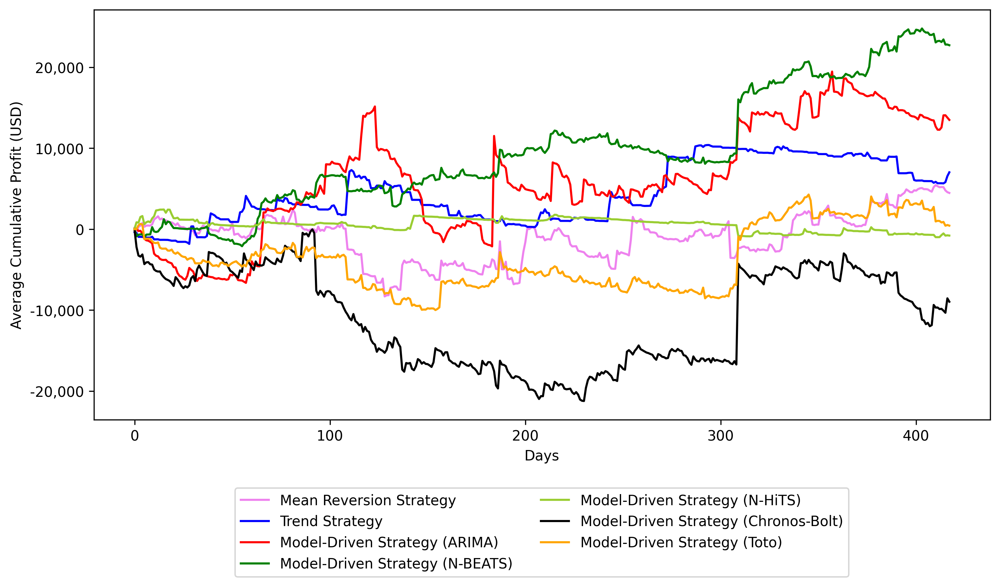
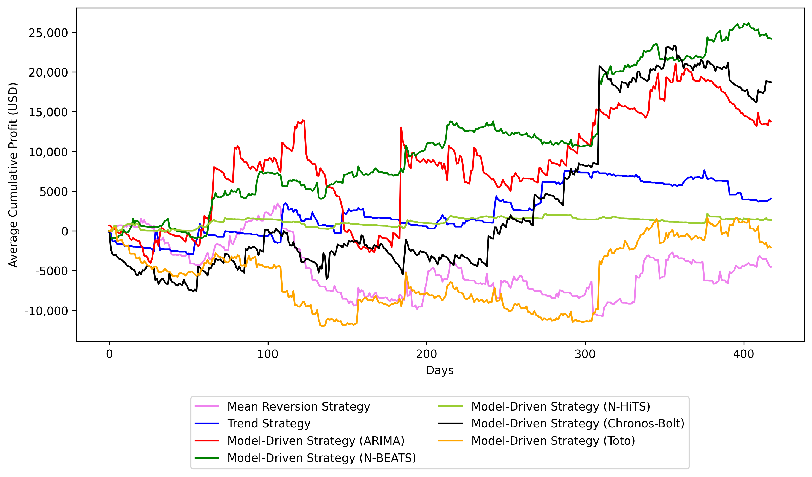
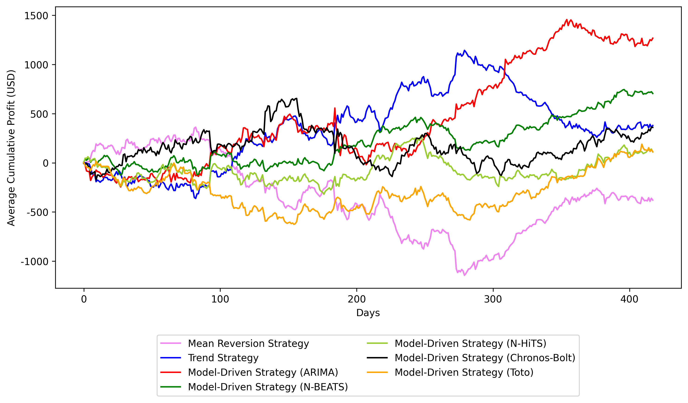
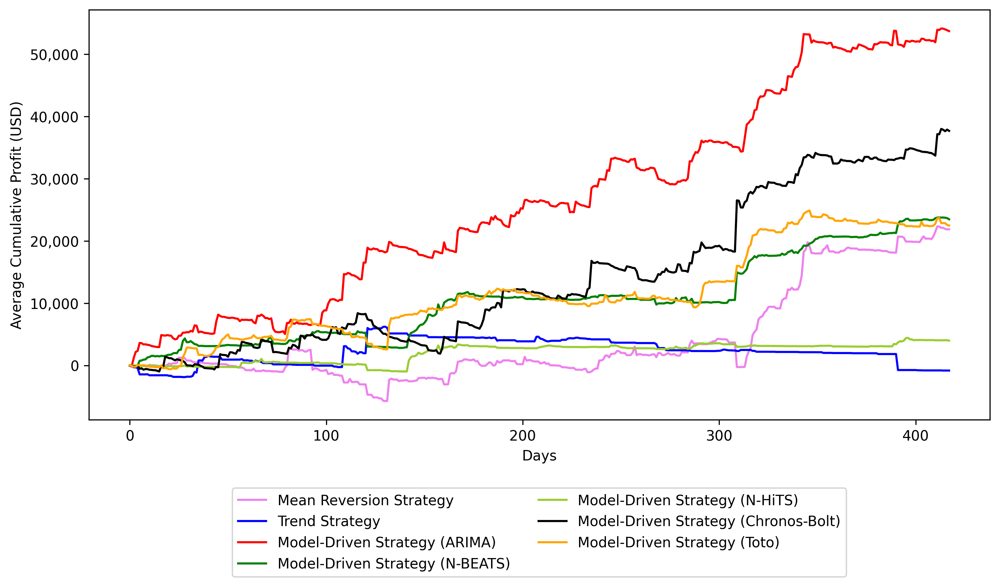
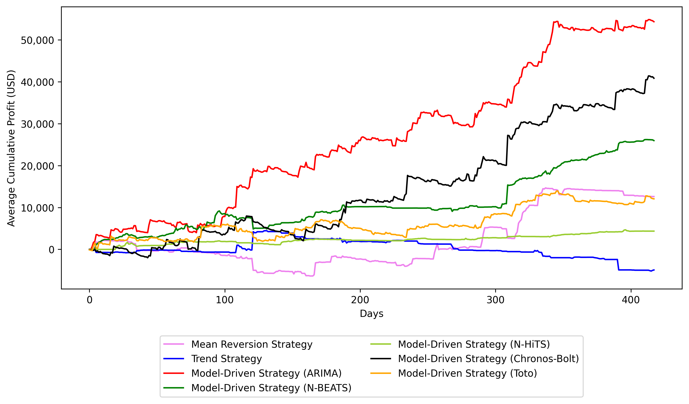
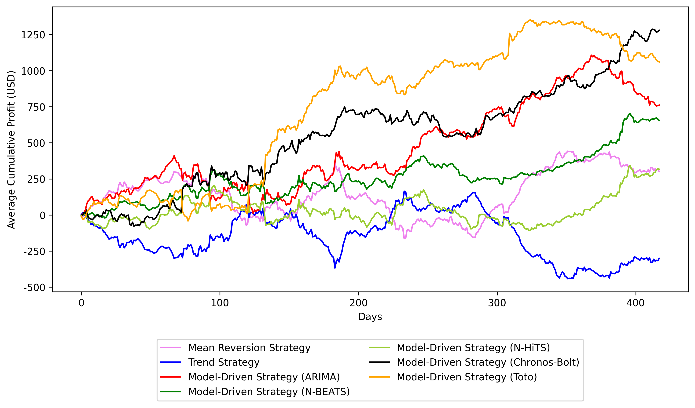
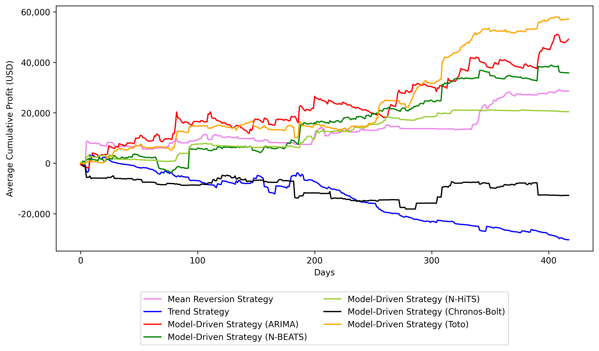
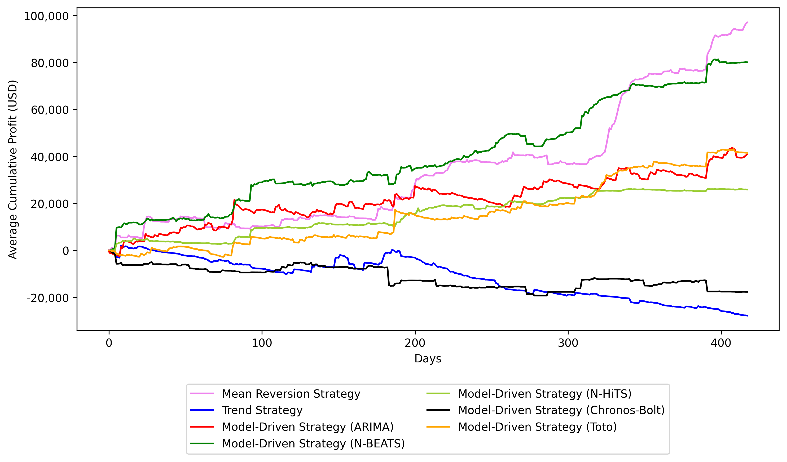
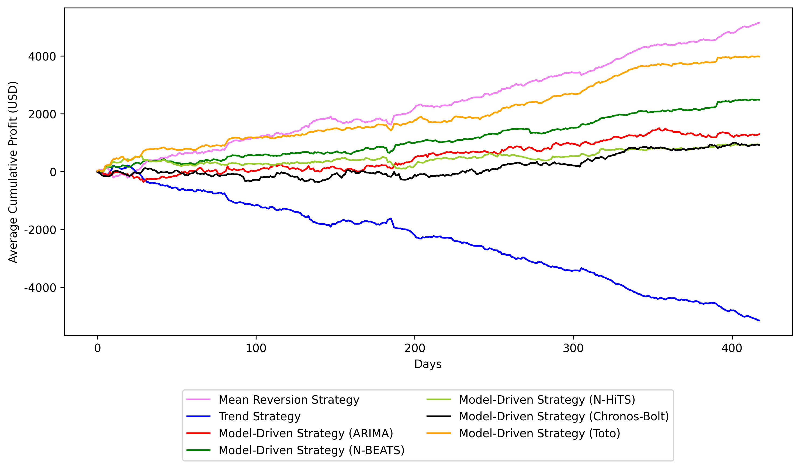

# ForExAI Follow-Up Results: USD/AUD, USD/CAD, and USD/JPY

This note reports follow-up trading results for three currency pairs that were not covered in the published paper: the US dollar against the Australian dollar (USD/AUD), the Canadian dollar (USD/CAD), and the Japanese yen (USD/JPY). The models, data pipeline, hyperparameter selection procedure, position sizing schemes, evaluation metrics, and train/validation/test protocol are unchanged from the paper. Only the currency pairs are new.

Three qualifications apply throughout. First, all profits reported here ignore transaction costs. The paper's transaction cost analysis (Section 18) showed that a flat $2.50 per order eliminates the profitability of nearly every strategy, so these numbers are not comparable to the cost-adjusted results in Tables 22 to 25 of the paper. They are comparable to the results in Sections 13 to 16. Second, the permutation test and bootstrap confidence intervals described in Section 9 of the paper were not run for these pairs, so the fixed position size tables here omit the p-value and confidence interval columns that appear in the paper. No claim of statistical significance is made for any result below. Third, the Moving Average Crossover, TCN, and Ensemble strategies were not included in this follow-up, and the predictive accuracy metrics of Section 17 (RMSE, MASE, MAPE, sMAPE) were not computed.

## Published Paper

Lemeneh, B.; Hadad, E.; Ajith, A.G.; Hou, Y.; Zha, C.; Scarozza, G.; Baannou, Z.; Liyeh, E.; Tomasic, A.; Shasha, D. ForExAI: Time Series Inference and News Article Analysis Reveal Profitable Foreign Exchange Signals. _Mathematics_ **2026**. https://doi.org/10.3390/math14132319

Section, table, equation, and figure references in this document refer to that paper.

## Setup

Foreign exchange price data for all three pairs were obtained from [massive.com](https://massive.com), at a resolution of at most one minute. Bid and ask prices were collected at each trade to compute the mid-price defined in Equation (2), and the resulting mid-price series serves as the signal for both model training and inference.

The data split follows Section 4.1. The training dataset spans 1 January to 30 June 2024, the validation dataset spans 1 July to 31 August 2024, and the test dataset spans 1 September 2024 to 31 December 2025. As in the paper, trading is simulated between 9 a.m. and 5 p.m. U.S. Eastern time, the holding time is one minute, and trading starts with $1,000,000 in holdings. The fixed position size is $10,000 USD per trade (Equation 31).

Seven strategies are evaluated: the rule-based Mean Reversion and Trend strategies (Equations 4 and 5), and the model-driven strategies (Equation 10) built on ARIMA(1,1,1), N-BEATS, N-HiTS, Chronos–Bolt, and Toto, all described in Section 2. The threshold parameter is T = 0 throughout, matching the main body of the paper rather than the threshold experiments in Appendix A.

Input context length and the Kelly parameters (rolling window size d, warm-up length N, and initial fixed fraction f) were selected by grid search on the validation set following the procedure in Section 10. Each configuration was evaluated under Active Kelly, Passive Kelly (Section 6.1), and fixed position sizing. Every reported figure is averaged over ten independent runs with different random seeds, as described in Section 8.

The five reported metrics are the average cumulative profit (ACP, Equation 33), the average profit per trade (APPT, Equation 32), the annualized average monthly Sharpe ratio (AAMSR, Equation 36), the average maximum drawdown (AMDD, Equation 39), and the average skewness (ASKEW, Equation 41). In every table, the boldface entry in a column indicates the best value in that column.

One caution carries over from Section 13.4 of the paper. Under fixed position sizing, cumulative profit and profit per trade scale directly with the position size traded in the simulation and can be inflated simply by trading larger. The Sharpe ratio, drawdown, and skewness are the more informative measurements in those tables.

## Trading Results for USD/Australian Dollar

**Table 1.** Active Kelly (Section 6.1) trading performance of all trading strategies on the US dollar vs. Australian dollar test dataset (1 September 2024 to 31 December 2025). N-BEATS achieves the highest average cumulative profit and the highest annualized average monthly Sharpe ratio. Trend achieves the highest average profit per trade.

| Trading Strategy            | Average Cumulative Profit (USD) | Average Profit Per Trade (USD/Trade) | Annualized Average Monthly Sharpe Ratio | Average Maximum Drawdown | Average Skewness |
| --------------------------- | ------------------------------- | ------------------------------------ | --------------------------------------- | ------------------------ | ---------------- |
| Mean Reversion              | 4480.99                         | 0.248                                | 0.339                                   | −0.0114                  | 0.0038           |
| Trend                       | 7028.61                         | **1.400**                            | 0.671                                   | −0.0075                  | 0.0094           |
| Model-driven (ARIMA)        | 13,504.87                       | 0.733                                | 0.618                                   | −0.0190                  | 0.0076           |
| Model-driven (N-BEATS)      | **22,725.73**                   | 0.666                                | **1.808**                               | −0.0097                  | 0.0182           |
| Model-driven (N-HiTS)       | −786.36                         | −0.045                               | −0.234                                  | −0.0065                  | −0.0014          |
| Model-driven (Chronos–Bolt) | −8956.88                        | −0.368                               | −0.438                                  | −0.0228                  | −0.0062          |
| Model-driven (Toto)         | 440.96                          | 0.014                                | 0.034                                   | −0.0140                  | 0.0002           |



**Figure 1.** US dollar vs. Australian dollar. Average cumulative profit (ACP) trajectories for all trading strategies using Active Kelly (Section 6.1) bet sizing.

**Table 2.** Passive Kelly (Section 6.1) trading performance of all trading strategies on the US dollar vs. Australian dollar test dataset (1 September 2024 to 31 December 2025). N-BEATS achieves the highest average cumulative profit and the highest annualized average monthly Sharpe ratio. Chronos–Bolt achieves the highest average profit per trade.

| Trading Strategy            | Average Cumulative Profit (USD) | Average Profit Per Trade (USD/Trade) | Annualized Average Monthly Sharpe Ratio | Average Maximum Drawdown | Average Skewness |
| --------------------------- | ------------------------------- | ------------------------------------ | --------------------------------------- | ------------------------ | ---------------- |
| Mean Reversion              | −4543.26                        | −0.253                               | −0.265                                  | −0.0142                  | −0.0040          |
| Trend                       | 4060.44                         | 1.074                                | 0.523                                   | −0.0052                  | 0.0058           |
| Model-driven (ARIMA)        | 13,779.44                       | 0.574                                | 0.652                                   | −0.0190                  | 0.0077           |
| Model-driven (N-BEATS)      | **24,195.93**                   | 0.719                                | **1.989**                               | −0.0091                  | 0.0192           |
| Model-driven (N-HiTS)       | 1381.15                         | 0.070                                | 0.549                                   | −0.0060                  | 0.0024           |
| Model-driven (Chronos–Bolt) | 18,718.27                       | **1.346**                            | 0.818                                   | −0.0089                  | 0.0138           |
| Model-driven (Toto)         | −2088.39                        | −0.064                               | −0.154                                  | −0.0157                  | −0.0018          |



**Figure 2.** US dollar vs. Australian dollar. Average cumulative profit (ACP) trajectories for all trading strategies using Passive Kelly (Section 6.1) bet sizing.

**Table 3.** Fixed position size trading performance of all trading strategies on the USD/AUD test dataset (1 September 2024 to 31 December 2025). ARIMA achieves the highest average cumulative profit and average profit per trade. N-BEATS achieves the highest annualized average monthly Sharpe ratio.

| Trading Strategy            | Average Cumulative Profit (USD) | Average Profit Per Trade (USD/Trade) | Annualized Average Monthly Sharpe Ratio | Average Maximum Drawdown | Average Skewness |
| --------------------------- | ------------------------------- | ------------------------------------ | --------------------------------------- | ------------------------ | ---------------- |
| Mean Reversion              | −379.43                         | −0.007                               | −0.372                                  | −0.0015                  | −0.0064          |
| Trend                       | 379.43                          | 0.007                                | 0.372                                   | −0.0009                  | 0.0064           |
| Model-driven (ARIMA)        | **1267.26**                     | **0.021**                            | 1.309                                   | −0.0007                  | 0.0205           |
| Model-driven (N-BEATS)      | 704.94                          | 0.011                                | **1.504**                               | −0.0006                  | 0.0113           |
| Model-driven (N-HiTS)       | 110.42                          | 0.002                                | 0.183                                   | −0.0005                  | 0.0018           |
| Model-driven (Chronos–Bolt) | 360.15                          | 0.006                                | 0.465                                   | −0.0008                  | 0.0058           |
| Model-driven (Toto)         | 111.96                          | 0.002                                | 0.177                                   | −0.0009                  | 0.0018           |



**Figure 3.** Average cumulative profit (ACP) trajectories for all trading strategies using fixed bet sizing. Results are shown for US dollar vs. Australian dollar.

USD/AUD is the least profitable of the three pairs studied here. Under Active Kelly, five of the seven strategies are profitable, with N-BEATS the strongest at 22,725.73 in average cumulative profit and the only strategy with a Sharpe ratio above 1.5. Chronos–Bolt loses 8956.88 and carries the largest drawdown in the table at −0.0228. Under Passive Kelly, N-BEATS again leads at 24,195.93, and Chronos–Bolt reverses from a loss to a gain of 18,718.27 with the highest profit per trade at 1.346, while Mean Reversion and Toto turn negative. Under fixed position sizing, all profits are small relative to the $1,000,000 of initial capital, with the largest, ARIMA at 1267.26, amounting to roughly 0.13 percent. As in the paper's fixed-size tables, Mean Reversion and Trend are exact mirror images of one another at ±379.43.

## Trading Results for USD/Canadian Dollar

**Table 4.** Active Kelly (Section 6.1) trading performance of all trading strategies on the US dollar vs. Canadian dollar test dataset (1 September 2024 to 31 December 2025). ARIMA achieves the highest average cumulative profit, average profit per trade, and annualized average monthly Sharpe ratio.

| Trading Strategy            | Average Cumulative Profit (USD) | Average Profit Per Trade (USD/Trade) | Annualized Average Monthly Sharpe Ratio | Average Maximum Drawdown | Average Skewness |
| --------------------------- | ------------------------------- | ------------------------------------ | --------------------------------------- | ------------------------ | ---------------- |
| Mean Reversion              | 21,864.65                       | 2.117                                | 1.178                                   | −0.0108                  | 0.0240           |
| Trend                       | −829.40                         | −0.553                               | −0.091                                  | −0.0090                  | −0.0016          |
| Model-driven (ARIMA)        | **53,715.89**                   | **3.572**                            | **3.226**                               | −0.0052                  | 0.0533           |
| Model-driven (N-BEATS)      | 23,473.96                       | 1.618                                | 2.713                                   | −0.0047                  | 0.0311           |
| Model-driven (N-HiTS)       | 3987.11                         | 0.243                                | 0.978                                   | −0.0042                  | 0.0076           |
| Model-driven (Chronos–Bolt) | 37,686.31                       | 2.407                                | 2.895                                   | −0.0070                  | 0.0376           |
| Model-driven (Toto)         | 22,480.74                       | 1.736                                | 1.659                                   | −0.0066                  | 0.0273           |



**Figure 4.** US dollar vs. Canadian dollar. Average cumulative profit (ACP) trajectories for all trading strategies using Active Kelly (Section 6.1) bet sizing.

**Table 5.** Passive Kelly (Section 6.1) trading performance of all trading strategies on the US dollar vs. Canadian dollar test dataset (1 September 2024 to 31 December 2025). ARIMA achieves the highest average cumulative profit and average profit per trade. Chronos–Bolt achieves the highest annualized average monthly Sharpe ratio.

| Trading Strategy            | Average Cumulative Profit (USD) | Average Profit Per Trade (USD/Trade) | Annualized Average Monthly Sharpe Ratio | Average Maximum Drawdown | Average Skewness |
| --------------------------- | ------------------------------- | ------------------------------------ | --------------------------------------- | ------------------------ | ---------------- |
| Mean Reversion              | 12,603.09                       | 2.545                                | 0.774                                   | −0.0101                  | 0.0207           |
| Trend                       | −4915.74                        | −3.939                               | −0.668                                  | −0.0116                  | −0.0109          |
| Model-driven (ARIMA)        | **54,327.17**                   | **3.445**                            | 3.088                                   | −0.0056                  | 0.0519           |
| Model-driven (N-BEATS)      | 25,959.92                       | 1.351                                | 2.942                                   | −0.0062                  | 0.0342           |
| Model-driven (N-HiTS)       | 4352.52                         | 0.313                                | 2.382                                   | −0.0035                  | 0.0097           |
| Model-driven (Chronos–Bolt) | 40,844.73                       | 2.410                                | **3.321**                               | −0.0059                  | 0.0426           |
| Model-driven (Toto)         | 12,057.22                       | 0.765                                | 1.104                                   | −0.0066                  | 0.0156           |



**Figure 5.** US dollar vs. Canadian dollar. Average cumulative profit (ACP) trajectories for all trading strategies using Passive Kelly (Section 6.1) bet sizing.

**Table 6.** Fixed position size trading performance of all trading strategies on the USD/CAD test dataset (1 September 2024 to 31 December 2025). Chronos–Bolt achieves the highest average cumulative profit, average profit per trade, and annualized average monthly Sharpe ratio.

| Trading Strategy            | Average Cumulative Profit (USD) | Average Profit Per Trade (USD/Trade) | Annualized Average Monthly Sharpe Ratio | Average Maximum Drawdown | Average Skewness |
| --------------------------- | ------------------------------- | ------------------------------------ | --------------------------------------- | ------------------------ | ---------------- |
| Mean Reversion              | 300.53                          | 0.006                                | 0.411                                   | −0.0005                  | 0.0082           |
| Trend                       | −300.53                         | −0.006                               | −0.411                                  | −0.0006                  | −0.0082          |
| Model-driven (ARIMA)        | 760.66                          | 0.012                                | 1.317                                   | −0.0004                  | 0.0188           |
| Model-driven (N-BEATS)      | 654.85                          | 0.010                                | 2.189                                   | −0.0003                  | 0.0160           |
| Model-driven (N-HiTS)       | 316.71                          | 0.005                                | 0.692                                   | −0.0004                  | 0.0077           |
| Model-driven (Chronos–Bolt) | **1278.36**                     | **0.020**                            | **2.765**                               | −0.0003                  | 0.0312           |
| Model-driven (Toto)         | 1060.02                         | 0.017                                | 1.431                                   | −0.0004                  | 0.0258           |



**Figure 6.** Average cumulative profit (ACP) trajectories for all trading strategies using fixed bet sizing. Results are shown for US dollar vs. Canadian dollar.

USD/CAD produces the most consistent results of the three pairs. Six of the seven strategies are profitable under Active Kelly and six under Passive Kelly, with Trend the sole loser in both cases. ARIMA leads on cumulative profit under both Kelly variants at 53,715.89 and 54,327.17, and the two Kelly variants differ by less than two percent on that metric. Chronos–Bolt is second on cumulative profit in both tables and takes the highest Sharpe ratio under Passive Kelly at 3.321. Under fixed position sizing, Chronos–Bolt leads on all three headline metrics, and its Sharpe ratio of 2.765 is achieved with a drawdown of −0.0003, three orders of magnitude smaller than the Kelly drawdowns for the same pair. Mean Reversion and Trend again mirror each other exactly at ±300.53.

## Trading Results for USD/Japanese Yen

**Table 7.** Active Kelly (Section 6.1) trading performance of all trading strategies on the US dollar vs. Japanese yen test dataset (1 September 2024 to 31 December 2025). Toto achieves the highest average cumulative profit and annualized average monthly Sharpe ratio. Mean Reversion achieves the highest average profit per trade.

| Trading Strategy            | Average Cumulative Profit (USD) | Average Profit Per Trade (USD/Trade) | Annualized Average Monthly Sharpe Ratio | Average Maximum Drawdown | Average Skewness |
| --------------------------- | ------------------------------- | ------------------------------------ | --------------------------------------- | ------------------------ | ---------------- |
| Mean Reversion              | 28,611.56                       | **7.334**                            | 1.615                                   | −0.0048                  | 0.0293           |
| Trend                       | −30,342.38                      | −1.847                               | −3.033                                  | −0.0355                  | −0.0265          |
| Model-driven (ARIMA)        | 49,131.67                       | 2.440                                | 1.907                                   | −0.0096                  | 0.0353           |
| Model-driven (N-BEATS)      | 35,813.24                       | 1.278                                | 1.983                                   | −0.0095                  | 0.0226           |
| Model-driven (N-HiTS)       | 20,430.29                       | 1.235                                | 1.738                                   | −0.0053                  | 0.0228           |
| Model-driven (Chronos–Bolt) | −12,761.20                      | −2.661                               | −0.811                                  | −0.0186                  | −0.0125          |
| Model-driven (Toto)         | **57,201.64**                   | 1.372                                | **2.790**                               | −0.0101                  | 0.0383           |



**Figure 7.** US dollar vs. Japanese yen. Average cumulative profit (ACP) trajectories for all trading strategies using Active Kelly (Section 6.1) bet sizing.

**Table 8.** Passive Kelly (Section 6.1) trading performance of all trading strategies on the US dollar vs. Japanese yen test dataset (1 September 2024 to 31 December 2025). Mean Reversion achieves the highest average cumulative profit and average profit per trade. N-BEATS achieves the highest annualized average monthly Sharpe ratio.

| Trading Strategy            | Average Cumulative Profit (USD) | Average Profit Per Trade (USD/Trade) | Annualized Average Monthly Sharpe Ratio | Average Maximum Drawdown | Average Skewness |
| --------------------------- | ------------------------------- | ------------------------------------ | --------------------------------------- | ------------------------ | ---------------- |
| Mean Reversion              | **97,030.74**                   | **10.265**                           | 2.295                                   | −0.0064                  | 0.0730           |
| Trend                       | −27,745.52                      | −1.651                               | −2.117                                  | −0.0319                  | −0.0248          |
| Model-driven (ARIMA)        | 40,915.43                       | 2.003                                | 1.844                                   | −0.0099                  | 0.0289           |
| Model-driven (N-BEATS)      | 80,086.78                       | 2.839                                | **3.324**                               | −0.0088                  | 0.0473           |
| Model-driven (N-HiTS)       | 25,921.98                       | 0.593                                | 2.323                                   | −0.0042                  | 0.0284           |
| Model-driven (Chronos–Bolt) | −17,633.55                      | −3.720                               | −1.214                                  | −0.0198                  | −0.0168          |
| Model-driven (Toto)         | 41,541.96                       | 2.035                                | 2.506                                   | −0.0085                  | 0.0306           |



**Figure 8.** US dollar vs. Japanese yen. Average cumulative profit (ACP) trajectories for all trading strategies using Passive Kelly (Section 6.1) bet sizing.

**Table 9.** Fixed position size trading performance of all trading strategies on the USD/JPY test dataset (1 September 2024 to 31 December 2025). Mean Reversion achieves the highest average cumulative profit and average profit per trade. Toto achieves the highest annualized average monthly Sharpe ratio.

| Trading Strategy            | Average Cumulative Profit (USD) | Average Profit Per Trade (USD/Trade) | Annualized Average Monthly Sharpe Ratio | Average Maximum Drawdown | Average Skewness |
| --------------------------- | ------------------------------- | ------------------------------------ | --------------------------------------- | ------------------------ | ---------------- |
| Mean Reversion              | **5149.83**                     | **0.125**                            | 5.576                                   | −0.0004                  | 0.0926           |
| Trend                       | −5149.83                        | −0.125                               | −5.576                                  | −0.0054                  | −0.0926          |
| Model-driven (ARIMA)        | 1292.07                         | 0.022                                | 1.876                                   | −0.0004                  | 0.0204           |
| Model-driven (N-BEATS)      | 2485.73                         | 0.040                                | 4.494                                   | −0.0003                  | 0.0386           |
| Model-driven (N-HiTS)       | 936.23                          | 0.015                                | 1.199                                   | −0.0005                  | 0.0145           |
| Model-driven (Chronos–Bolt) | 921.42                          | 0.015                                | 1.342                                   | −0.0005                  | 0.0143           |
| Model-driven (Toto)         | 3981.80                         | 0.064                                | **5.650**                               | −0.0003                  | 0.0617           |



**Figure 9.** Average cumulative profit (ACP) trajectories for all trading strategies using fixed bet sizing. Results are shown for US dollar vs. Japanese yen.

USD/JPY shows both the largest gains and the largest losses of the three pairs. Under Passive Kelly, Mean Reversion returns 97,030.74 with an average profit per trade of 10.265, the highest single value on either metric anywhere in this follow-up, and N-BEATS returns 80,086.78 with a Sharpe ratio of 3.324. Under Active Kelly the picture is more modest, with Toto leading at 57,201.64. Chronos–Bolt is unprofitable under both Kelly variants, at −12,761.20 and −17,633.55, and Trend loses 30,342.38 under Active Kelly with a drawdown of −0.0355, the worst drawdown in the follow-up. Under fixed position sizing, the Sharpe ratios are the highest reported here, 5.650 for Toto and 5.576 for Mean Reversion, though the corresponding cumulative profits of 3981.80 and 5149.83 are small against the initial capital.

## Discussion

**Position sizing.** Neither Kelly variant dominates the other, which is consistent with the paper's conclusion that Active Kelly enjoys only a slight edge overall. Passive Kelly produces the higher cumulative profit for the best strategy in USD/AUD (24,195.93 against 22,725.73) and USD/JPY (97,030.74 against 57,201.64), and the two are within two percent for USD/CAD (54,327.17 against 53,715.89). As in the paper, fixed position sizing produces maximum drawdowns that are orders of magnitude smaller than either Kelly variant: for USD/CAD, −0.0003 to −0.0006 under fixed sizing against −0.0035 to −0.0116 under Passive Kelly.

**Magnitude relative to the published pairs.** The new pairs sit between the paper's extremes. The best fixed-size cumulative profits here range from 1267.26 for USD/AUD to 5149.83 for USD/JPY, in the same range as the paper's USD/GBP (4354.71, Table 17) and USD/EUR (7431.97, Table 20), and far below USD/BRL (30,642.79, Table 14). Under Kelly sizing, the best result here is 97,030.74 for USD/JPY, which exceeds the paper's best USD/CNY result (35,573.40, Table 10) but falls short of USD/EUR (109,895.18, Table 18) and is two orders of magnitude below USD/BRL (2,052,664.12, Table 12).

**Which models lead.** ARIMA(1,1,1) leads USD/CAD on cumulative profit under both Kelly variants, echoing the paper's observation that ARIMA emerges as the strongest performer over the test horizon. Chronos–Bolt behaves inconsistently across the new pairs: it is the fixed-size leader for USD/CAD at 1278.36 and second on Kelly cumulative profit for that pair, yet it loses money for USD/JPY under both Kelly variants and for USD/AUD under Active Kelly. N-BEATS, which the paper describes as rarely performing well, leads USD/AUD on cumulative profit under both Kelly variants and takes the highest Passive Kelly Sharpe ratio for USD/JPY at 3.324. The paper's most reliable Sharpe performer, the Ensemble, was not run for these pairs, so no comparison is available.

**Rule-based strategies.** Under fixed position sizing, Mean Reversion and Trend produce exactly offsetting results for all three pairs (±379.43, ±300.53, ±5149.83), the same structure seen in Tables 14, 17, and 20 of the paper. Mean Reversion is profitable under fixed sizing for USD/CAD and USD/JPY and unprofitable for USD/AUD.

**Interpreting the absence of transaction costs.** These results are not actionable by a trader. The paper's Section 18 found that a flat $2.50 per order eliminated profitability for the overwhelming majority of strategies, and that fixed position sizing, which executed on the order of 80,000 to 140,000 trades over the test period, generated commission burdens of $200,000 to $350,000 that dwarfed gross profits. Average trade counts were not recorded for the new pairs, so the equivalent adjustment in Equation (43) cannot be computed here. Given that the gross fixed-size profits reported above are between 110.42 and 5149.83, any trade count of the magnitude reported in the paper would eliminate them entirely. The Kelly results are less trade-intensive and therefore less exposed, but the same caveat applies in the absence of measured trade counts.

**Statistical significance.** The permutation test of Section 9 was not run for these pairs. Every result above should be read as a point estimate averaged over ten random seeds, without a test against a randomized trading baseline.

## Citation

```bibtex
@article{lemeneh2026forexai,
  title   = {ForExAI: Time Series Inference and News Article Analysis Reveal Profitable Foreign Exchange Signals},
  author  = {Lemeneh, Beakal and Hadad, Eli and Ajith, Allen George and Hou, Yanbo and Zha, Charlie and Scarozza, Ganesh and Baannou, Zakaria and Liyeh, Ermiyas and Tomasic, Anthony and Shasha, Dennis},
  journal = {Mathematics},
  volume  = {14},
  number  = {13},
  pages   = {2319},
  year    = {2026},
  publisher = {MDPI},
  doi     = {10.3390/math14132319},
  url     = {https://doi.org/10.3390/math14132319}
}
```

## Disclaimer

This project is a research tool for studying signal detection in FX markets, not a ready made trading system.
